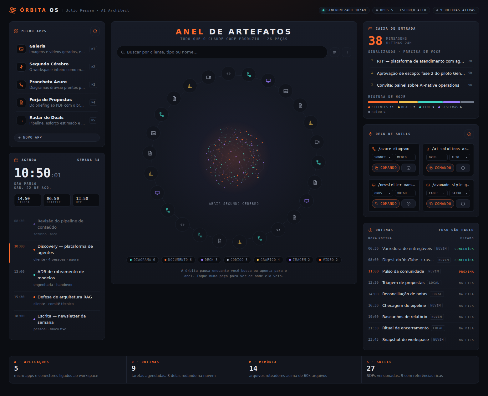

# Órbita OS

Painel de comando para um workspace agêntico rodando em cima do Claude Code.
Arquivo único, sem build, sem dependência: abra `index.html` no navegador.



## O que é

Uma releitura do padrão de "Agentic OS" popularizado pelo Rubric (Jay E / RoboNuggets),
organizada em torno do framework **ARMS** — os quatro elementos que sustentam um
workspace agêntico:

| | Camada | No painel |
|---|---|---|
| **A** | Aplicações | Trilho de micro apps, conectores |
| **R** | Rotinas | Tabela de tarefas agendadas com a próxima destacada |
| **M** | Memória | Núcleo do Segundo Cérebro — o mapa dos arquivos roteadores |
| **S** | Skills | Deck de skills com modelo e esforço por execução |

Mais o **anel de artefatos**: um índice visual e buscável de tudo que o agente já
produziu, porque achar de novo o que foi gerado há três semanas é o gargalo real.

## Como funciona

Todo o conteúdo vem do objeto `OS`, no topo do `<script>`. Não há backend nem
chamada de rede: o painel é uma casca de apresentação sobre dados que você fornece.

```js
const OS = {
  timezone: 'America/Sao_Paulo',
  microApps: [...],
  agenda:    [...],
  email:     {...},
  skills:    [...],
  routines:  [...],
  brain:     {...},   // arquivos roteadores por departamento
  artifacts: [...]    // o anel
};
```

Trocar os valores já entrega um painel seu. Para dados vivos, gere esse bloco:

```bash
claude -p "Leia ~/workspace e escreva agentic-os/os-data.js exportando o objeto OS
no formato do index.html: artefatos dos últimos 60 dias, rotinas do crontab e
skills de .claude/skills." --model claude-opus-5
```

Depois troque o bloco embutido por `<script src="os-data.js"></script>`.

## Disparo headless de skills

Cada card do deck monta o comando com o modelo e o esforço escolhidos e copia para
a área de transferência — o botão diz `Comando` porque é exatamente isso que ele faz.
Uma página estática não abre processo:

```bash
MAX_THINKING_TOKENS=31999 claude -p "/newsletter-maestro" --model claude-opus-5
```

Para o botão executar de verdade, sirva a página por um processo mínimo que exponha
`POST /run` fazendo spawn desse comando e devolvendo a saída. O painel não muda:
só o handler de `data-run`.

## Detalhes de implementação

- **Anel** — nós posicionados por `transform: rotate(θ) translate(R) rotate(-θ)`,
  com contra-rotação no botão para o ícone ficar sempre em pé. A órbita pausa ao
  apontar, ao buscar e ao filtrar por tipo.
- **Núcleo** — nuvem de 300 pontos em esfera de Fibonacci, arestas pré-calculadas
  por vizinho mais próximo, projeção em canvas 2D. Um frame estático sob
  `prefers-reduced-motion`.
- **Relógio** — `Intl.DateTimeFormat` com `timeZone`, sem biblioteca de datas.
  Agenda e rotinas recalculam estado a cada 30 s a partir da hora local do fuso.
- **Tema** — escuro por decisão, não por omissão: é um console. Todas as cores
  saem de tokens em `:root` e o `body` pinta o próprio fundo.
- **Atalhos** — `/` foca a busca, `Esc` fecha o painel de detalhe.

## Créditos

Framework ARMS e o formato de dashboard: Jay E (RoboNuggets), no vídeo
"O NOVO padrão de SO Agêntico para modelos Claude 5". Implementação e design daqui
são originais.
